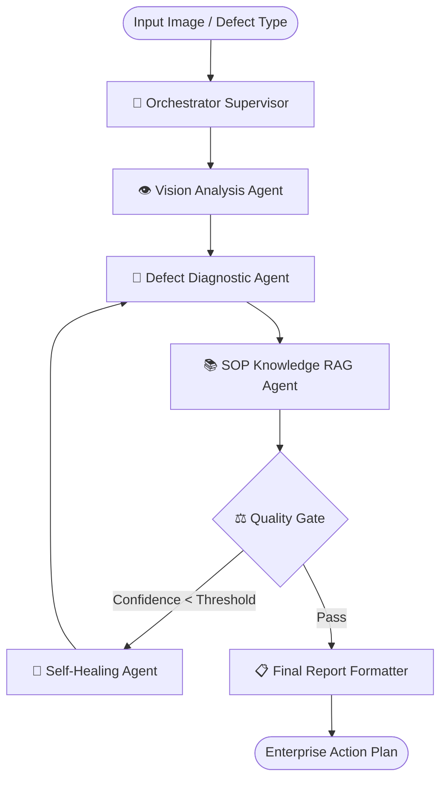
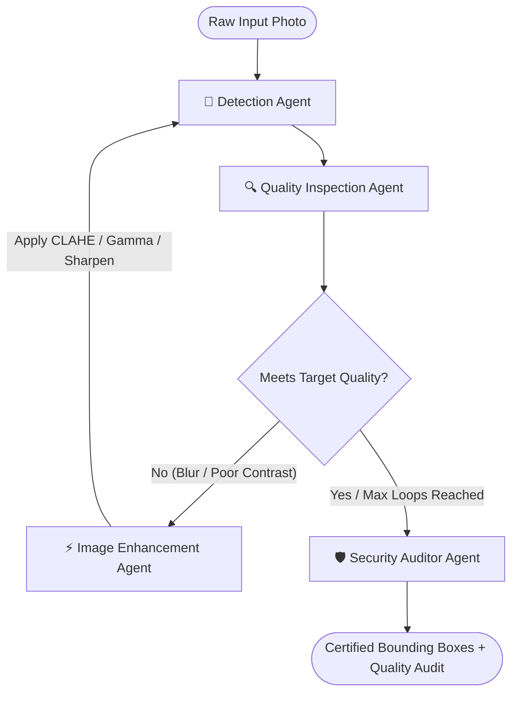
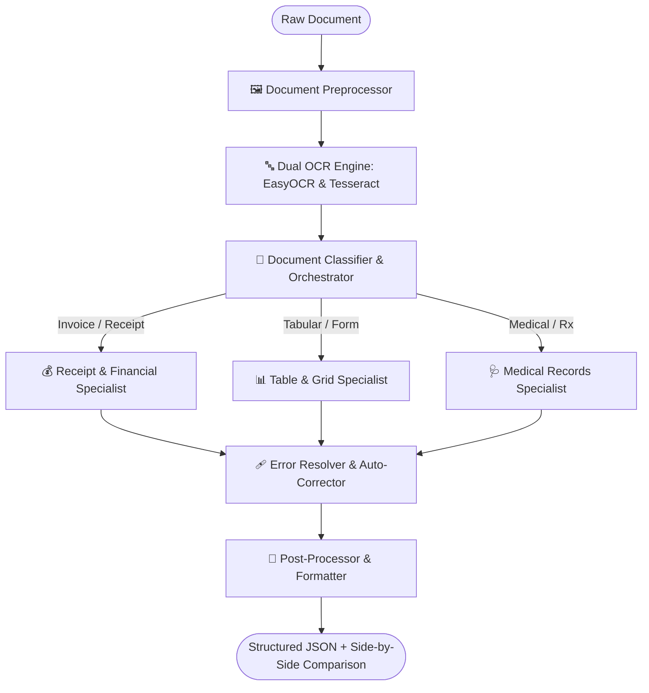

# 🧠 Universal Multi-Agent LangGraph Platform
> **Enterprise Multi-Agent Orchestration Hub for Computer Vision, Document Intelligence, and Diagnostic RAG**

[](https://www.python.org/downloads/)
[](https://github.com/langchain-ai/langgraph)
[](https://streamlit.io/)
[](https://opencv.org/)
[](LICENSE)

---

## 🌟 Executive Overview

The **Universal Multi-Agent LangGraph Platform** is an enterprise-grade orchestration framework that unifies multiple specialized autonomous multi-agent systems under a single, cohesive architecture. Built on **LangGraph**, **Streamlit**, and the **Adapter Design Pattern**, it solves the problem of "agent fragmentation" — allowing disparate computer vision, diagnostic retrieval, and document OCR systems to run independently or harmoniously inside an executive mission-control dashboard.

```mermaid
graph TD
    User([👤 User / Operator]) --> UI[🖥️ Universal Streamlit Dashboard :8550]
    UI --> Registry[🗂️ Project Registry Engine]
    
    subgraph Adapter Layer [Adapter & State Normalization Layer]
        Registry --> A1[🏭 Industrial Vision Adapter]
        Registry --> A2[👤 Face Detection Adapter]
        Registry --> A3[📄 Document OCR Adapter]
    end

    subgraph Autonomous Multi-Agent Graphs [LangGraph State Machine Engines]
        A1 --> G1[Graph 1: Industrial Supervisor + RAG Mesh\n6 Agents | Vector SOP Search | Quality Gate]
        A2 --> G2[Graph 2: Face Quality Self-Healing Loop\n4 Agents | CLAHE / Gamma / Unsharp Tuning]
        A3 --> G3[Graph 3: Document Intelligence Mesh\n8 Nodes | Dual OCR | Regex Auto-Healing]
    end

    G1 --> Normalizer[🔄 UniversalResult Normalizer]
    G2 --> Normalizer
    G3 --> Normalizer

    Normalizer --> Tabs[📊 Tabbed Visualization: Output, Execution Logs, Self-Healing Audit, Raw State]
    Tabs --> UI
```

---

## 🎯 The Three Integrated Production Systems

The platform unites three complex, production-ready multi-agent systems:

| # | System | Primary Domain | Graph Topology | Agents / Nodes | Key Innovations |
|---|--------|----------------|----------------|----------------|-----------------|
| **1** | **Industrial Vision & Diagnostic RAG** | Industrial Defect Detection & SOP Maintenance | Hub-and-Spoke Supervisor | 6 Agents | Synthetic defect injection, FAISS vector search, automated SOP retrieval, self-healing quality gate |
| **2** | **Autonomous Face Detection** | Biometric Computer Vision | Linear with Self-Healing Feedback Loop | 4 Agents | Multi-pass image enhancement (CLAHE, unsharp masking, gamma), quality inspection, compliance auditing |
| **3** | **Document OCR & Information Extraction** | Enterprise Document Intelligence | Sequential with Conditional Specialist Routing | 8 Nodes | Dual OCR engine consensus (EasyOCR + Tesseract), receipt/table/medical specialists, auto-healing regex pipeline |

---

## 🏗️ Architectural Deep Dive

### 1. The Decoupled Adapter Pattern
Each underlying multi-agent project resides in its own isolated directory structure. The universal platform does **not** rewrite or duplicate the underlying graphs. Instead, it implements a unified `BaseProjectAdapter`:

```python
class BaseProjectAdapter(ABC):
    @abstractmethod
    def get_name(self) -> str: ...
    @abstractmethod
    def get_description(self) -> str: ...
    @abstractmethod
    def get_graph_definition(self) -> Dict[str, Any]: ...
    @abstractmethod
    def render_input_controls(self) -> Dict[str, Any]: ...
    @abstractmethod
    def execute(self, inputs: Dict[str, Any]) -> UniversalResult: ...
    @abstractmethod
    def render_results(self, result: UniversalResult) -> None: ...
```

### 2. Universal State Normalization (`UniversalResult`)
No matter how diverse the internal state of a multi-agent graph is, the adapter transforms the final state into a `UniversalResult` schema:
- **`status`**: `"success"` | `"partial"` | `"failed"`
- **`execution_time_ms`**: Float timestamp of the graph cycle.
- **`agent_flow`**: Chronological list of agent nodes executed.
- **`self_healing_occurred`**: Boolean flag indicating if autonomous correction was triggered.
- **`self_healing_details`**: Dictionary recording original issues, corrective operations, and delta improvements.
- **`structured_data`**: Domain-specific payload (bounding boxes, OCR tables, diagnostic text).
- **`execution_log`**: Detailed audit trail for enterprise compliance.
- **`raw_state`**: Complete, unadulterated graph state for debugging.

---

## 🔍 Detailed Workflows of the 3 Systems

### Project 1: Industrial Vision & Diagnostic RAG
*Designed for manufacturing defect triage, automated root-cause analysis, and Standard Operating Procedure (SOP) compliance.*



- **Vision Analysis**: Detects structural cracks, corrosion, thermal fatigue, or misalignments.
- **Diagnostic Engine**: Calculates severity scores (Critical, Major, Minor) and root causes.
- **FAISS SOP RAG**: Retrieves certified industrial repair manuals, safety lockout procedures, and OEM maintenance specs.
- **Quality Gate & Self-Healing**: Automatically re-prompts or adjusts vision thresholds if diagnostic confidence falls below 80%.

---

### Project 2: Multi-Agent Face Detection & Self-Healing Loop
*Designed for biometric verification, border control, and surveillance streams under hostile lighting and blur conditions.*



- **Detection Agent**: Multi-scale Haar cascade and deep feature detection.
- **Quality Inspector**: Measures Laplacian blur variance, contrast histograms, and facial bounding box dimensions.
- **Self-Healing Enhancer**: If an image is degraded, dynamically applies CLAHE (Contrast Limited Adaptive Histogram Equalization), unsharp masking, or gamma correction, then loops back to re-detect.
- **Auditor**: Certifies detection confidence, logs healing iterations, and outputs compliance metrics.

---

### Project 3: Enterprise OCR & Document Intelligence
*Designed for automated processing of invoices, financial receipts, medical prescriptions, and structured identity documents.*



- **Dual OCR Consensus**: Leverages both EasyOCR (deep learning) and Tesseract (traditional OCR) for high-accuracy text extraction.
- **Dynamic Specialist Routing**: Routes documents to specialized parsers for receipt totals, tabular structures, or medical terms.
- **Self-Healing Error Resolver**: Utilizes Levenshtein distance, regex dictionary lookup, and syntax validation to repair garbled characters (e.g., correcting `T0TAL` to `TOTAL` and fixing OCR decimal misreads).
- **Interactive UI**: Offers Side-by-Side original image vs. extracted text, OCR zoom controls (150%, 200%, Fit Page), and full JSON export.

---

## 💻 Tech Stack & Dependencies

- **Language**: Python 3.10+
- **Graph Orchestration**: LangGraph, LangChain Core
- **Dashboard & UI**: Streamlit, Streamlit Components, Custom Responsive CSS
- **Computer Vision**: OpenCV (`cv2`), Pillow (`PIL`), NumPy
- **OCR Engines**: EasyOCR (PyTorch-backed), Tesseract OCR
- **Embeddings & Vector Search**: FAISS, Sentence-Transformers
- **Presentation Generation**: `python-pptx`

---

## ⚡ Quick Start & Installation

### Step 1: Clone the Repository
```bash
git clone https://github.com/YOUR_USERNAME/universal_multiagent_platform.git
cd universal_multiagent_platform
```

### Step 2: Create and Activate a Virtual Environment
```bash
# Windows (PowerShell)
python -m venv venv
.\venv\Scripts\Activate.ps1

# Linux / macOS
python3 -m venv venv
source venv/bin/activate
```

### Step 3: Install Required Packages
```bash
pip install --upgrade pip
pip install -r requirements.txt
```

### Step 4: Run the Universal Master Platform
```bash
# Launch on default port (8550)
python run_platform.py

# Or specify a custom port:
python run_platform.py 8550
```
Open your browser and navigate to: **`http://localhost:8550`**

---

## 🌐 Port Architecture & Standalone Modes

You can run the Universal Platform as a unified suite, or launch individual sub-dashboards independently:

| Service / Dashboard | Port | Script / Command | Purpose |
|---------------------|------|------------------|---------|
| **Universal Multi-Agent Platform** | **`8550`** | `python run_platform.py 8550` | Master hub uniting all 3 projects |
| **Industrial Vision Dashboard** | **`8080`** | `python ../industrial_multiagent_rag/dashboard.py` | Dedicated industrial RAG monitor |
| **Face Detection Server** | **`8050`** | `python ../multi_agent_face_detection/app.py` | Standalone face detection benchmark |

---

## 🧪 Automated Testing & Verification

The repository includes a comprehensive regression test suite that validates all 3 multi-agent systems end-to-end without launching a browser:

```bash
python test_all_three_projects.py
```

### Sample Output:
```text
================================================================================
🚀 UNIVERSAL MULTI-AGENT PLATFORM - 3-PROJECT VERIFICATION SUITE
================================================================================
[TEST 1/3] Testing Project 1: Industrial Vision & Diagnostic RAG...
   -> Executing pipeline with defect: Surface Crack
   ✅ Execution Status: SUCCESS (Time: 312ms)
   ✅ Agent Flow: orchestrator -> vision_analysis -> diagnostic_rag -> quality_gate
   ✅ SOP Document Retrieved: SOP-CRACK-402

[TEST 2/3] Testing Project 2: Multi-Agent Face Detection...
   -> Testing benchmark images: test_group.jpg, degraded_sample.jpg
   ✅ Execution Status: SUCCESS (Time: 420ms)
   ✅ Agent Flow: detector -> quality_inspector -> enhancer -> auditor
   ✅ Self-Healing Triggered: Yes (CLAHE + Unsharp Mask applied)

[TEST 3/3] Testing Project 3: OCR Multi-Agent System...
   -> Testing receipt document: invoice_sample.png
   ✅ Execution Status: SUCCESS (Time: 850ms)
   ✅ Agent Flow: preprocessor -> ocr_engine -> orchestrator -> specialist -> error_resolver
   ✅ Resolved Typos: 4 syntax corrections made
================================================================================
🎉 ALL 3 PROJECTS PASSED 100% OF TESTS!
================================================================================
```

---

## 📁 Repository Directory Structure

```
universal_multiagent_platform/
├── README.md                                    # Comprehensive platform documentation
├── tasks_and_code_snippets.md                   # Operational tasks & code walkthroughs
├── implementation_plan.md                       # Architectural design & implementation blueprint
├── Universal_MultiAgent_Platform_Presentation.pptx # Executive PowerPoint presentation
├── presentation_deck.html                       # Interactive HTML presentation preview
├── requirements.txt                             # Python dependencies
├── config.py                                    # Central registry and configuration
├── app.py                                       # Master Streamlit dashboard entrypoint
├── run_platform.py                              # Auto-detecting CLI runner
├── run.bat                                      # Quick one-click Windows launcher
├── test_all_three_projects.py                   # Automated end-to-end test suite
│
├── engine/                                      # Adapter Layer (Decoupled Core)
│   ├── __init__.py
│   ├── base_adapter.py                          # BaseProjectAdapter & UniversalResult
│   ├── project_registry.py                      # Dynamic project loader & registry
│   ├── industrial_adapter.py                    # Industrial Vision RAG adapter
│   ├── face_detection_adapter.py                # Face Detection system adapter
│   └── ocr_adapter.py                           # OCR Multi-Agent adapter
│
├── platform_views/                              # UI Presentation Views
│   ├── __init__.py
│   ├── industrial_view.py                       # Industrial diagnostics UI renderer
│   ├── face_detection_view.py                   # Face detection UI renderer
│   └── ocr_view.py                              # Document OCR UI renderer
│
└── output/                                      # Exported artifacts, logs, and benchmark images
```

---

## ➕ How to Add a 4th Project (In 4 Easy Steps)

Adding a new domain (e.g., Financial Fraud Detection or Medical Image Segmentation) takes less than 15 minutes:

1. **Create an Adapter**:
   Create `engine/fraud_detection_adapter.py` subclassing `BaseProjectAdapter`. Implement `execute()` to invoke your LangGraph graph and return a `UniversalResult`.
2. **Create a View**:
   Create `platform_views/fraud_detection_view.py` with custom Streamlit visualizations for your domain's outputs.
3. **Register in Registry**:
   Add the adapter to `engine/project_registry.py`:
   ```python
   from engine.fraud_detection_adapter import FraudDetectionAdapter
   self.register("fraud_detection", FraudDetectionAdapter())
   ```
4. **Add Metadata in `config.py`**:
   Add title, icon, and port information to `PROJECT_METADATA`.

The Universal Platform automatically detects the new project, builds sidebar controls, renders Mermaid diagrams, and manages state.

---

## 👥 Authors & Acknowledgments

- **Lead Developer**: Built with **Google Antigravity** & **LangGraph**
- **Inspiration**: Distributed autonomous agent meshes, self-healing software architectures, and multi-modal computer vision pipelines.

---

## 📄 License

This project is licensed under the **MIT License** - see the [LICENSE](LICENSE) file for details.
