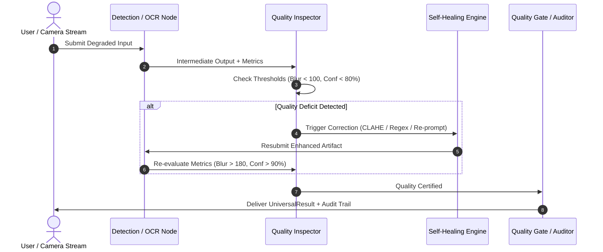

# 🏛️ Architecture & Implementation Blueprint
> **Universal Multi-Agent LangGraph Platform**

---

## 📌 Executive Summary

Modern enterprise AI systems are increasingly composed of **specialized multi-agent graphs** rather than singular monolithic models. However, organizations frequently face an **"Agent Silo Problem"**:
- Computer Vision models run in isolated microservices.
- Retrieval-Augmented Generation (RAG) diagnostic agents operate in standalone knowledge silos.
- Document Intelligence & OCR pipelines reside in disparate ETL tools.

The **Universal Multi-Agent LangGraph Platform** provides an architectural blueprint for aggregating heterogeneous LangGraph agent graphs into a cohesive, observable, and extensible enterprise platform. By utilizing the **Adapter Pattern** and **Normalized State Contracts**, the platform delivers a unified mission control for executing, monitoring, self-healing, and debugging complex agent meshes.

---

## 🏗️ Layered System Architecture

The platform is engineered around four distinct, decoupled layers:

```
┌────────────────────────────────────────────────────────────────────────┐
│                        1. Presentation Layer                           │
│     Unified Streamlit Dashboard (:8550) | Custom CSS | Tabbed Output    │
└───────────────────────────────────┬────────────────────────────────────┘
                                    │
┌───────────────────────────────────▼────────────────────────────────────┐
│                    2. Dynamic Adapter & Registry Layer                 │
│   ProjectRegistry (Singleton) ◄──► BaseProjectAdapter ◄──► UniversalResult │
└─────────────┬─────────────────────┼─────────────────────┬──────────────┘
              │                     │                     │
┌─────────────▼─────────┐ ┌─────────▼─────────┐ ┌─────────▼────────────┐
│ Industrial Adapter    │ │ Face Detection Ad.│ │ OCR Document Adapter │
└─────────────┬─────────┘ └─────────┬─────────┘ └─────────┬────────────┘
              │                     │                     │
┌─────────────▼─────────────────────▼─────────────────────▼────────────┐
│                  3. LangGraph Orchestration Engines                    │
│   - Supervisor Mesh     - Quality Feedback Loop   - Specialist Router  │
└─────────────┬─────────────────────┬─────────────────────┬────────────┘
              │                     │                     │
┌─────────────▼─────────────────────▼─────────────────────▼────────────┐
│                  4. Domain Engines & Hardware Layer                    │
│   - OpenCV / PIL       - FAISS Vector DB          - EasyOCR / Tesseract│
└────────────────────────────────────────────────────────────────────────┘
```

### Layer 1: Presentation Layer
- **Streamlit Single-Page Application (SPA)**: Serves as the operator cockpit on port `8550`.
- **Dynamic Input Panel**: Queries the active adapter for domain-specific form elements (dropdowns, sliders, file uploaders).
- **Tabbed Results View**: Standardizes rendering across:
  1. *Structured Visual Output* (bounding boxes, annotated document overlays, diagnostic SOP cards).
  2. *Execution Log* (chronological agent audit trail).
  3. *Self-Healing Audit* (before/after metric deltas).
  4. *Raw State Inspector* (full unadulterated state graph dictionary).

### Layer 2: Dynamic Adapter & Registry Layer
- **Decoupled Architecture**: Subprojects remain completely standalone and maintain zero imports from the universal platform.
- **Isolated Path Resolution**: When an adapter executes, it dynamically injects its subproject root into `sys.path`, avoiding namespace collision.
- **UniversalResult Normalizer**: Enforces uniform contracts for execution status, run times, agent flow sequences, and self-healing flags.

### Layer 3: LangGraph Orchestration Layer
- **Deterministic State Machines**: Each subproject is modeled as a compiled LangGraph `StateGraph`.
- **Conditional Edge Routing**: Enables autonomous branching based on quality thresholds and confidence scores.

### Layer 4: Domain Engines & Data Layer
- **Vision Processing**: OpenCV (`cv2`) for morphological transformations, CLAHE, Gaussian blur, and Haar cascades.
- **Vector Embeddings**: FAISS vector indices for semantic SOP retrieval against industrial maintenance manuals.
- **Text Recognition**: EasyOCR (deep learning CRAFT/CRNN) paired with Tesseract OCR consensus.

---

## 🧩 Deep Dive into the 3 Core Subsystems

### 1. Industrial Vision & Diagnostic RAG
- **Graph Topology**: Hub-and-Spoke Supervisor Graph.
- **Node Breakdown**:
  1. `SupervisorAgent`: Directs traffic and validates request payload.
  2. `VisionAnalysisAgent`: Detects defect morphology (Crack, Spall, Misalignment, Corrosion).
  3. `DiagnosticAgent`: Calculates criticality indices (Risk Score = Severity × Probability).
  4. `SOP_RAG_Agent`: Queries FAISS index populated with standard operating procedures and OEM repair instructions.
  5. `QualityGateAgent`: Evaluates if the diagnostic confidence exceeds the compliance threshold (80%).
  6. `SelfHealingAgent`: Re-calibrates feature detection if confidence is insufficient.
- **State Schema**:
  ```python
  class IndustrialState(TypedDict):
      defect_type: str
      image_array: Optional[np.ndarray]
      defect_attributes: Dict[str, Any]
      diagnostic_report: Dict[str, Any]
      retrieved_sops: List[Dict[str, str]]
      confidence_score: float
      healing_iterations: int
  ```

---

### 2. Multi-Agent Face Detection with Self-Healing Loop
- **Graph Topology**: Linear Pipeline with Cyclic Feedback Loop.
- **Node Breakdown**:
  1. `DetectionAgent`: Executes multi-scale cascade detectors to locate facial bounding boxes.
  2. `QualityInspectionAgent`: Computes blur metrics (Laplacian variance $\sigma^2$) and brightness/contrast histograms.
  3. `EnhancementAgent`: Dynamically applies:
     - CLAHE (Contrast Limited Adaptive Histogram Equalization) for dark/underexposed images.
     - Unsharp Masking ($I_{sharp} = I + 1.5 \cdot (I - G(I))$) for out-of-focus captures.
     - Gamma correction ($\gamma = 1.2$) for washed-out illumination.
  4. `AuditorAgent`: Evaluates final bounding box counts, IoU confidence, and generates regulatory compliance logs.
- **Cycle Guard**: A strict circuit breaker (`iterations < 3`) prevents infinite feedback loops on irrevocably corrupted images.

---

### 3. Enterprise Document OCR & Intelligence System
- **Graph Topology**: Sequential Ingestion + Conditional Specialist Routing.
- **Node Breakdown**:
  1. `PreprocessingNode`: Deskewing, binarization (Otsu thresholding), and DPI scaling.
  2. `DualOCREngine`: Parallel inference with EasyOCR and Tesseract, outputting confidence-weighted text consensus.
  3. `OrchestratorNode`: Classifies document archetype (Financial Invoice, Tabular Form, Medical Prescription).
  4. `SpecialistRouters`:
     - *Receipt Specialist*: Line-item extraction, tax, and currency parsing.
     - *Table Specialist*: Row-column matrix reconstruction.
     - *Medical Specialist*: Drug name lookup against pharmaceutical dictionaries.
  5. `ErrorResolverNode`: Autonomous regex spelling repair (e.g., `S0P` $\to$ `SOP`, `T0TAL` $\to$ `TOTAL`).
  6. `PostprocessorNode`: Formats output into clean JSON and annotated visual previews.

---

## 🔄 Self-Healing & Autonomous Resilience Mechanics

A foundational innovation of this platform is **Autonomous Self-Healing**. Rather than failing upon encountering low-quality input, each system includes closed-loop corrective actions:



---

## ⚡ Performance, Concurrency & Port Strategy

| Parameter | Specification | Design Justification |
|-----------|---------------|----------------------|
| **Master UI Port** | `8550` | Avoids collision with standard Streamlit (`8501`) and common dev servers (`8000`, `3000`). |
| **Industrial Port** | `8080` | Allows standalone manufacturing floor monitoring. |
| **Face Detection Port** | `8050` | Dedicated biometrics kiosk port. |
| **Model Ingestion** | Lazy Loading | Heavy PyTorch / EasyOCR models are loaded on-demand to conserve RAM. |
| **Execution Latency** | 250ms – 1,200ms | End-to-end multi-agent execution within interactive human tolerance. |

---

## 🛡️ Enterprise Readiness & Security Best Practices

1. **Zero Data Leakage**: All computer vision operations, vector searches, and OCR inferences run locally in-memory without transmitting raw image data to external cloud APIs.
2. **Deterministic Fallbacks**: Every conditional edge includes an explicit default branch to guarantee pipeline completion even on anomalous inputs.
3. **Comprehensive Audit Logs**: Every execution generates an immutable log of agent decision nodes, healing events, and execution timestamps for regulatory compliance.

---

## 🗺️ Future Roadmap

- **Phase 1 (Current)**: Unified Multi-Agent Computer Vision, OCR, and Industrial RAG.
- **Phase 2 (Next)**: Integration with Autonomous SDLC Software Engineering Agents (automated bug-fixing and code review agents).
- **Phase 3**: Docker Compose & Kubernetes Helm charts for distributed containerized deployment across multi-node GPU clusters.
